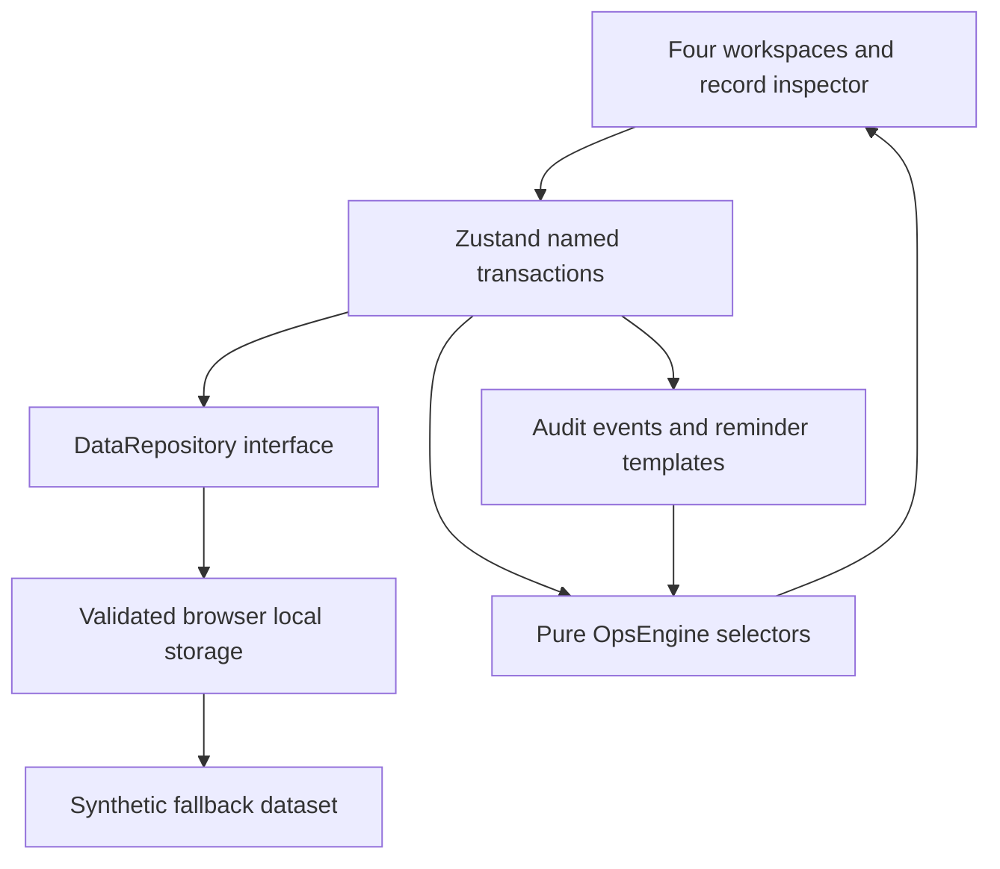

# Architecture

## Module ownership

- `app/`: App Router shell, locally bundled fonts, global design tokens, entry page.
- `components/`: workspace navigation, semantic display primitives, shared confirmation dialog.
- `features/`: Cohort Control, Admissions, Participant Ops, Operations Brief, Inspector, CommandMenu. Views contain filtering/display state but no core readiness or escalation rules.
- `domain/types.ts`: typed entities and enumerated stages.
- `domain/OpsEngine.ts`: pure temporal, readiness, conflict, escalation, queue and brief rules.
- `data/seed.ts`: a fresh deterministic fixture for every reset/test.
- `data/repository.ts`: synchronous `load/save/reset` boundary and Zod shape validation.
- `store/useOpsStore.ts`: named state actions, immutable copy per transaction, persistence, user feedback and audit append.
- `tests/`, `e2e/`: rule, state, UI and production-browser proof.

## State ownership and hydration

Seed data renders identically on server and client; a short loading surface prevents showing stale seeded working records before local state loads. Client hydration reads the repository once. Invalid or unavailable storage triggers a notice and usable seeded/in-memory state. All mutations are synchronously written to one versioned key. Full-cohort data is retained; cohort switching changes context, not datasets. Working filters, view and inspector selection are intentionally ephemeral.

Selectors derive queue/brief data on render, so there is no second cache of readiness or brief text to become inconsistent. The `Generate weekly brief` control refreshes the compilation timestamp; the content is always live. A fixed demonstration clock avoids dependence on real-world dates. Time-shift actions are audited.

## Transactions

Actions clone the dataset, change a record, append an operator audit event and persist the resulting dataset. Reminder drafts deduplicate by entity and demo date. Room updates reject a new overlapping booking before writing. Sensitive support closures require a confirmation flag; UI offer/acceptance moves confirm responsible-reviewer decisions. Notes are rendered as text, not HTML.

## Tradeoffs

A small store is simpler to explain than a service/event infrastructure. Native tables handle this dataset without virtualization or TanStack Table. CSS transitions handle fast panel opening without a motion dependency. No chart library is needed. Zod checks storage shape but is not an authorization boundary and does not validate all referential constraints. Whole-dataset writes are suitable for a small local demo; multi-user concurrency requires server transactions.

## Production replacement

An asynchronous backend repository would need explicit loading/error states, optimistic transaction rollback, resource versioning, permissions and a durable server audit. Replace display-name team/supervisor references with IDs. Use server time for SLA evaluation and role-specific visibility for sensitive support. Separate approved communications from outbound delivery and record delivery results. Authentication and privacy controls are prerequisites before real participant data.
