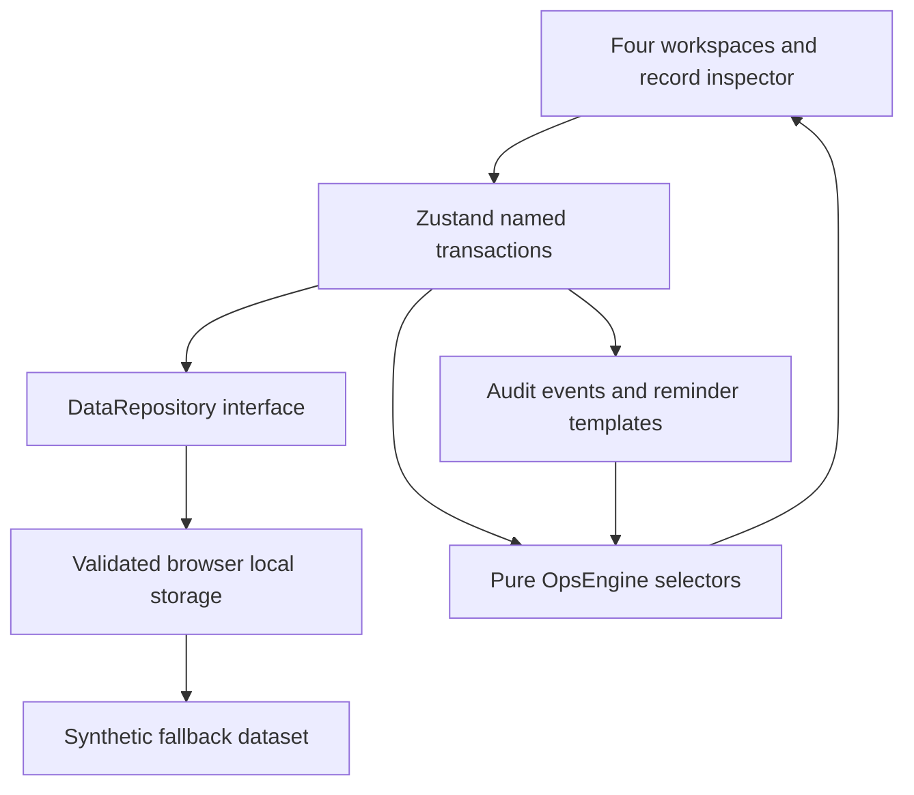

# Architecture

## Module ownership

- `app/`: App Router shell, locally bundled fonts, global design tokens, entry page.
- `components/`: workspace navigation, semantic display primitives, shared confirmation dialog, responsive media-query subscription and anchored Demo controls.
- `features/`: Cohort Control, Admissions, Participant Ops, Operations Brief, Inspector, CommandMenu. Views contain filtering/display state but no core readiness or escalation rules.
- `domain/types.ts`: typed entities and enumerated stages.
- `domain/OpsEngine.ts`: pure temporal, readiness, conflict, escalation, queue and brief rules.
- `data/seed.ts`: a fresh deterministic fixture for every reset/test.
- `data/repository.ts`: synchronous `load/save/reset` boundary and Zod shape validation.
- `store/useOpsStore.ts`: named state actions, immutable copy per transaction, persistence, user feedback and audit append.
- `tests/`, `e2e/`: rule, state, UI and production-browser proof.

## State ownership and hydration

Seed data renders identically on server and client; a short loading surface prevents showing stale seeded working records before local state loads. Client hydration reads the repository once. Invalid or unavailable storage triggers a notice and usable seeded/in-memory state. All mutations are synchronously written to one versioned key. Full-cohort data is retained; cohort switching changes context, not datasets. Working filters, view and inspector selection are intentionally ephemeral.

Selectors derive queue/brief data on render, so there is no second cache of readiness or brief text to become inconsistent. The Current Operations Brief is explicitly live and has no generation control or compilation timestamp. Clipboard export reads current derived state. A fixed demonstration clock avoids dependence on real-world dates. Time-shift actions are audited.

## Transactions

Actions clone the dataset, change a record, append an operator audit event and persist the resulting dataset. Reminder drafts deduplicate by entity and demo date. Room updates reject a new overlapping booking before writing. Sensitive support closures require a confirmation flag; UI offer/acceptance moves confirm responsible-reviewer decisions. Notes are rendered as text, not HTML.

## Tradeoffs

A small store is simpler to explain than a service/event infrastructure. Native tables handle this dataset without virtualization or TanStack Table. CSS transitions handle fast panel opening without a motion dependency. No chart library is needed. Zod checks storage shape but is not an authorization boundary and does not validate all referential constraints. Whole-dataset writes are suitable for a small local demo; multi-user concurrency requires server transactions.

## Production replacement

An asynchronous backend repository would need explicit loading/error states, optimistic transaction rollback, resource versioning, permissions and a durable server audit. Replace display-name team/supervisor references with IDs. Use server time for SLA evaluation and role-specific visibility for sensitive support. Separate approved communications from outbound delivery and record delivery results. Authentication and privacy controls are prerequisites before real participant data.

## Refined inspector and command interaction

A shared `useMediaQuery` subscription uses the same 1280px breakpoint as the shell. Desktop uses a nonmodal Radix surface with a labeled region role, no overlay and no outside-click dismissal; the main workspace accommodates a 440px pane. Main content uses container queries so narrower available width adapts without squeezing contextual panels. Tablet/mobile use a modal dialog, overlay and focus containment. Record selection remains in the existing store; rows derive their selected appearance from its ID and kind. No dataset schema or operational rule changed.

Commands close their palette before focusing the current working surface or the record inspector. Cancellation restores the original focus target. Board ticket selectors dispatch the same `moveApplicant` transaction as the inspector; Offer/Accepted route through the existing human-review confirmation. Demo time actions are grouped in an accessible anchored popover and still call audited store transactions. The legacy local-storage key is intentionally unchanged to preserve saved V1 data.

## Hosting and validation boundary

A standard Next.js production build is deployable on Vercel without a database or runtime credentials. Hosting serves the application; datasets still live separately in each visitor’s browser. Browser fixtures fail on console errors and uncaught exceptions. `PLAYWRIGHT_BASE_URL` selects a real remote host and disables local-server startup for post-deployment verification. Public hosting remains unverified until account authentication, deployment and those checks complete.
