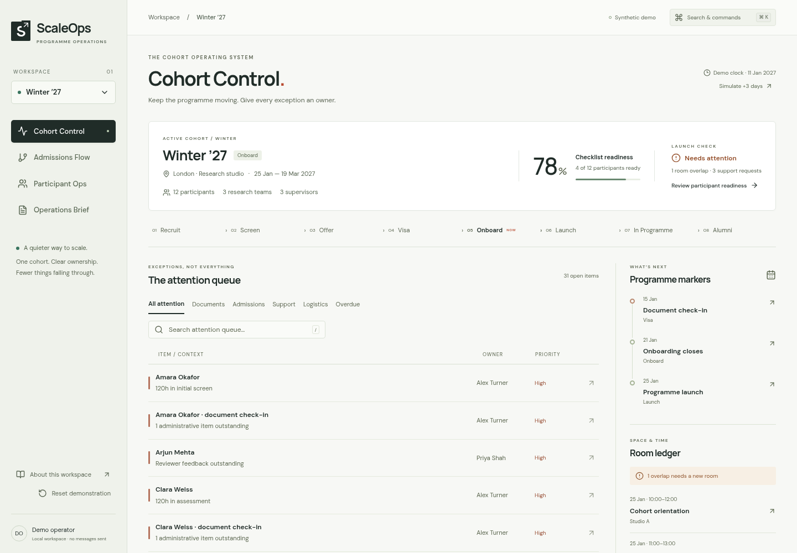

# LASR ScaleOps

A cohort operating workspace for the coordination work between an application and a supported research participant. Built as an independent portfolio prototype for the **LASR Labs / Arcadia Impact Programme Operations Associate** application.

**Synthetic demonstration data — not LASR internal data.** Names, programme dates, teams, rooms, checklists and operational policies are fictional. This is not an official LASR product and makes no claim about its internal processes.



## The operational problem

Scaling a programme multiplies handoffs: reviewer feedback, missing documents, access invitations, arrivals, room bookings and support requests. A list of headline metrics does little to help an operator close these loops. ScaleOps instead starts with an exception queue: what needs attention, why, who owns it, and which record to act on.

The role's programme administration, participant support, scheduling, communications and process-improvement work motivates the four connected surfaces:

- **Cohort Control:** interactive lifecycle, prioritised attention queue, owned deadlines and room ledger.
- **Admissions Flow:** stage counts, searchable/reviewer-filtered table, board representation, stage clocks, explicit review SLA, batch movement and reviewer ownership.
- **Participant Ops:** document receipt and human administrative review, onboarding and allocation checklists, team/supervisor context, arrivals and support history.
- **Operations Brief:** a live memo derived from current records, decisions required, review bottlenecks, readiness, logistics, upcoming milestones and the past seven days of changes.

## Try the working relationships

1. In Winter ’27, search the attention queue for **Maya** and open her document check-in. Complete the two document items. The document blocker disappears; checklist readiness increases. Complete her access and orientation items to make her checklist-ready.
2. Open **Room booking overlap** and move orientation to the seminar room. The logistics alert disappears. A proposed overlapping room assignment is rejected.
3. Resolve the missing workspace invitation support request. The support queue and weekly brief update; the participant's support history retains the closed request.
4. In Admissions, filter to **Initial screen**, open Amara, move her to Interview and record feedback. The stage clock resets and the board reflects the move.
5. Open the brief to see these changes. Use **Simulate +3 days** to surface new overdue actions. Switch cohort to compare different programme contexts.
6. Use **⌘K / Ctrl+K** to find a person or run commands. **/** focuses the current search. Escape dismisses the inspector or command menu. Reset restores all synthetic records after confirmation.

Changes persist locally across refreshes. Reset clears changes, notes and reminder drafts. No messages are sent, and no credentials are needed.

## Running locally

Node **22 or 24** (Next.js requires Node 20.9 or later), npm, and a modern browser:

```sh
npm ci
npm run dev
```

Open the development server on port 3000. For a production run:

```sh
npm run build
npm run start
```

Fonts are bundled locally; the running demo does not request a font CDN, AI API or database. The seed clock starts at 11 January 2027 rather than the computer's current date. All displayed programme times use Europe/London.

## Architecture and data model

Next.js App Router provides the shell and build pipeline. React components consume a typed Zustand store. A `DataRepository` interface isolates local persistence and validates saved datasets with Zod. `OpsEngine` contains pure rules; components display results and dispatch named transactions. The app uses native tables, CSS design tokens, Lucide icons and Radix dialogs rather than a generic admin template.

The model contains cohorts, applicants, participants, requirements, tasks, support requests, rooms, schedule entries, milestones, risks and audit events. Team and supervisor names remain embedded in participant records: V1 does not need independent assignment management. The fixture contains 54 applicants and 19 participants across three cohorts. Applicants represent the active demonstration pipeline; participant registers include previously accepted records and are not automatically generated from an acceptance change.

Read [ARCHITECTURE.md](ARCHITECTURE.md), [DATA_MODEL.md](DATA_MODEL.md) and [DECISION_RULES.md](DECISION_RULES.md) for boundaries and exact rules.

## Deterministic OpsEngine and AI boundaries

Operational truth is reproducible: elapsed review time, overdue actions, missing requirements, room interval overlaps and brief source events are explicit calculations. The 72-hour reviewer and 48-hour support windows are **demonstration policies, not LASR policies**. Checklist readiness is not legal eligibility. Launch coordination clearance also checks open support, overdue tasks and room conflicts.

No live model is connected. Reminder drafts use a fixed template, are deduplicated per record/day, require human review and never send. The weekly brief is deterministic, not AI generated. Visa/legal, welfare and complaints require human handling; offer/acceptance UI changes confirm a reviewer decision. ScaleOps does not score candidates, infer protected attributes or provide legal advice. See [AI_BOUNDARIES.md](AI_BOUNDARIES.md).

## Product decisions

The workspace combines warm light surfaces, quiet sage navigation, ink headings and a restrained rust attention accent. Queues, an interactive lifecycle, a contextual inspector and an editorial memo each serve different work; they do not repeat one card layout. Desktop density is retained; narrow screens use navigation controls and horizontally scrollable tables. Modal focus handling, keyboard commands and reduced-motion support are included. See [PRODUCT.md](PRODUCT.md) and [UX_PRINCIPLES.md](UX_PRINCIPLES.md).

## Tests

```sh
npm run lint
npm run typecheck
npm test
npm run build
npm run test:e2e
```

Playwright uses `/usr/bin/chromium` when available. Else install its matching browser with `npx playwright install chromium`, or set `PLAYWRIGHT_EXECUTABLE_PATH` to a compatible installed browser. The browser suite starts the production server if one is not already running. Build first. Tests cover domain boundaries, persistent actions, UI filters, four browser journeys and an automated accessibility/focus journey. A GitHub Actions workflow runs the quality gates on pushes and pull requests. See [TEST_PLAN.md](TEST_PLAN.md) and [BUILD_STATUS.md](BUILD_STATUS.md) for verified outcomes.

## Limits and production path

This is a single-browser prototype, not a live programme administration system. It has no authentication, role permissions, outbound communications, file uploads, hosted storage, concurrent editing or true audit immutability. Administrative documents are checklist statuses, never stored documents. Sensitive case details should not be entered. The store contains synthetic records only, and can be edited by the browser owner. Acknowledging a risk is not resolving it. Room capacity is shown but attendee counts are not modeled. Board movement uses the inspector, not drag-and-drop. State survives refresh, but navigation returns to Cohort Control.

Production would require a server-backed repository, relational IDs and constraints, cohort-scoped authorization, transactional audit records, retention/privacy policies, protected document storage, communication approval/delivery tracking, human escalation procedures and timezone-aware calendar integration. Optional AI assistance should use narrow, redacted inputs and reviewed outputs separate from authoritative operational records. There is no need to add a model to demonstrate deterministic coordination.
